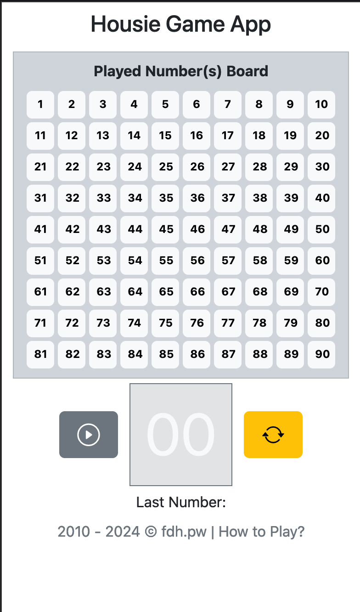
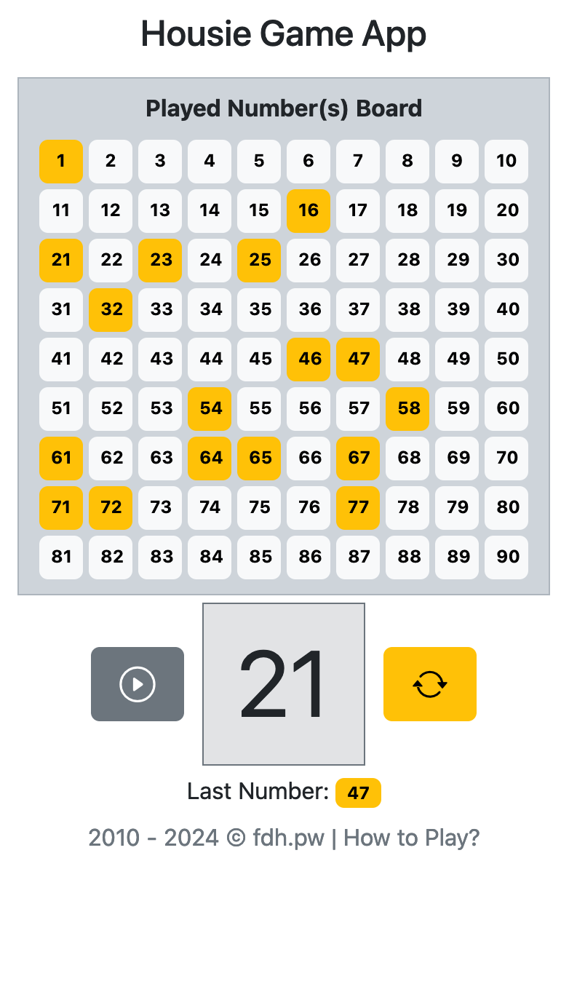
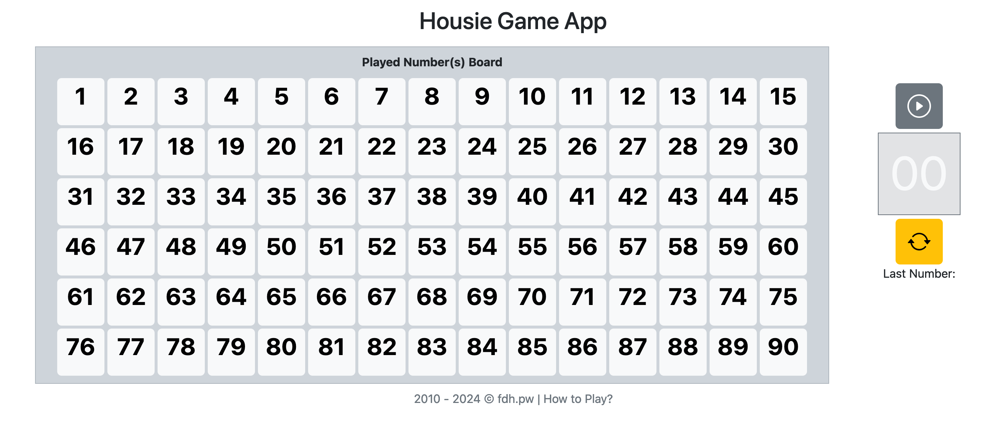
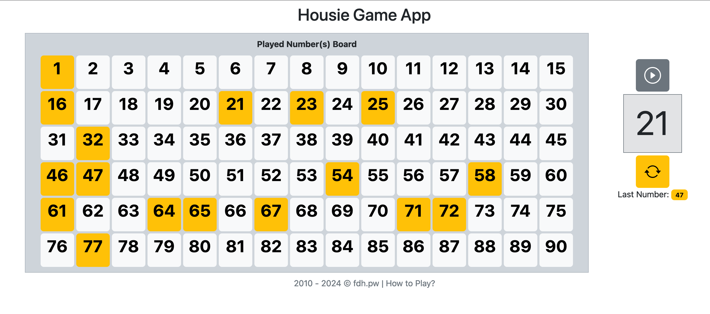

# Play Housie Game

This webapp will replace the physical board and balls, so you can just have physical tickets.

A random number between 1-90 is generated (using Math.random() inbuild function of javascript) and saved on the board.

This app is purely made using html and JavaScript with Bootstrap for styling. We use js-cookie library to save the game progress.

# Screen Shot of the webapp

**On mobile device**

 

**On Desktop Browser**

 

demo https://cn.fdh.pw
