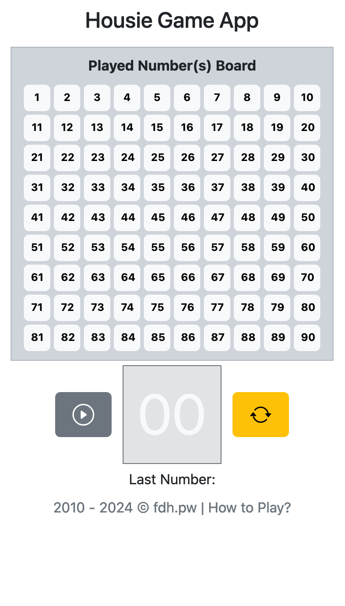

# Play Housie Game

This webapp will replace the physical board and balls, so you can just have physical tickets.

A random number between 1-90 is generated (using Math.random() inbuild function of javascript) and saved on the board.

This app is purely made using html and JavaScript with [Bootstrap](https://getbootstrap.com) for styling. We use [js-cookie](https://github.com/js-cookie/js-cookie) library to save the game progress.

Demo of the app at [cn.fdh.pw](https://cn.fdh.pw)

# Screen Shot of the webapp

**On mobile device**

  

**On Desktop Browser**

 

